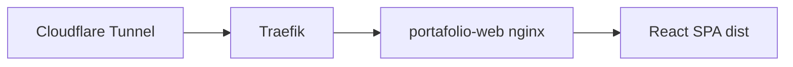

# System Patterns

## Architecture



- **Frontend**: React 18 + Vite + TypeScript + Tailwind + React Router
- **Production**: Docker (Node build → nginx) on `ai-server`, Traefik labels in `docker-compose.yml`
- **Network**: `net_internal` (external), Traefik entrypoint `web` (HTTP; TLS at Cloudflare)

## Code organization

```
src/
  sections/     # Home page sections (Hero, About, Portfolio, …)
  pages/        # Route-level pages (ProjectsPage, ProjectDetail, AboutPage, …)
  components/   # Shared UI (Logo, SectionHeader, SEO, …)
  config/       # seo.ts, schema.ts, colors
  data/         # blog.ts (static content)
public/
  screenshots/  # Project images (static URLs)
  assets/       # logos, social icons
```

## Recurring patterns

- **SectionHeader**: badge + title + optional description
- **GradientButton**: primary CTA with yellow-green gradient
- **SEO**: `SEOHead` + `seoConfig` per route; `StructuredData` JSON-LD
- **Portfolio cards**: `PortfolioGrid` → `PortfolioCard` → `/projects/:slug`
- **Case studies**: `CaseStudySections` maps problem / role / stack / outcome

## Routing gotcha

- App route `/projects` must NOT conflict with a physical `public/projects/` folder (caused 403 on Apache/Hostinger). Images live under `/screenshots/`.

## Deploy flow

1. Push to `main` on GitHub
2. Self-hosted runner `ai-server-portafolio` pulls `/srv/apps/portafolio`
3. `docker compose -p portafolio build && up -d`

Manual: `ssh ai-server 'cd /srv/apps/portafolio && ./scripts/deploy.sh'`
