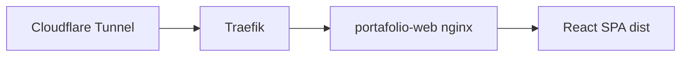

# System Patterns

## Architecture


```mermaid
flowchart LR
  CF[Cloudflare Tunnel] --> Traefik
  Traefik --> Portafolio[portafolio-web nginx]
  Portafolio --> SPA[React SPA dist]
```

- **Frontend**: React 18 + Vite + TypeScript + Tailwind + React Router
- **Production**: Docker (Node build → nginx) on `ai-server`, Traefik labels in `docker-compose.yml`
- **Network**: `net_internal` (external), Traefik entrypoint `web` (HTTP; TLS at Cloudflare)

## Code organization

```
src/
  sections/     # Home page sections (Hero, About, Portfolio, …)
  pages/        # Route-level pages (ProjectsPage, ProjectDetail, AboutPage, …)
  components/   # Shared UI (Logo, SectionHeader, SEO, LanguageSwitcher, …)
  config/       # seo.ts, schema.ts, colors
  data/         # blog.ts + posts/*.ts (localized BlogBlock content, {es,en})
  i18n/         # react-i18next init + locales/{en,es}/*.json (namespaces per section)
  hooks/        # useLocale (locale-aware route prefixing / switching)
content/
  blog/         # editorial system: sessions, drafts, published Markdown, system/
public/
  screenshots/  # Project images (static URLs)
  assets/       # logos, social icons
```

## Recurring patterns

- **SectionHeader**: badge + title + optional description
- **GradientButton**: primary CTA with yellow-green gradient
- **SEO**: `SEOHead` + `seoConfig` per route; `StructuredData` JSON-LD
- **Portfolio cards**: `PortfolioGrid` → `PortfolioCard` → `/projects/:slug`
- **Case studies**: `CaseStudySections` maps problem / role / stack / outcome

## Routing gotcha

- App route `/projects` must NOT conflict with a physical `public/projects/` folder (caused 403 on Apache/Hostinger). Images live under `/screenshots/`.
- App route `/blog` must NOT conflict with a physical `public/blog/` folder (nginx 403). Blog images live under `/blog-assets/`.

## i18n (react-i18next)

- **Detection**: `i18next-browser-languagedetector` (`navigator.language`, `localStorage` cache). Non-Spanish browsers fall back to English.
- **Routes**: all pages live under `/:lang` (`/es/...`, `/en/...`). `RootRedirect` at `/` sends to detected locale. `LocaleLayout` validates `:lang` and sets `document.documentElement.lang`.
- **URLs already indexed** (unprefixed) have nginx 301 maps in `nginx/default.conf` (about/blog/planes/cotización → `/es`, home/projects → `/en`).
- **Localized content**: UI copy in `src/i18n/locales/{en,es}/*.json` (namespaces per section). Blog post body/title/description/tags are `Localized<T> = {es,en}` in `src/data/posts/*.ts`. SEO copy lives in `locales/*/seo.json`; `getSEOConfig(pathname, t)` and schema builders take `t` + `lang`.
- **Links**: use `useLocale().to('/path')` for any internal `Link`/`navigate` that would otherwise drop the locale prefix. `LanguageSwitcher` swaps `/es` ↔ `/en` preserving the current route.
- **Technical terms**: keep Software Engineer, SaaS, MVP, Fullstack, Frontend, CTO, LLM, RAG, AI, stack names in English in both locales (per user's call).


## Blog editorial flow

```text
ChatGPT (CHATGPT_CONTEXT.md) → sessions/ → Cursor draft → review → published/ + src/data/posts/
Images: media/inbox/ or chat paste → media/[slug]/ + public/blog-assets/[slug]/ + manifest.md
```

- Rules: `content/blog/AGENTS.md`, `.cursor/rules/storytelling-blog.mdc`
- Memory: `system/VOICE.md`, `EDITORIAL_MEMORY.md`, `CONTENT_LEDGER.md`, `CHATGPT_CONTEXT.md`

## Deploy flow

1. Push to `main` on GitHub
2. Self-hosted runner `ai-server-portafolio` pulls `/srv/apps/portafolio`
3. `docker compose -p portafolio build && up -d`

Manual: `ssh ai-server 'cd /srv/apps/portafolio && ./scripts/deploy.sh'`
